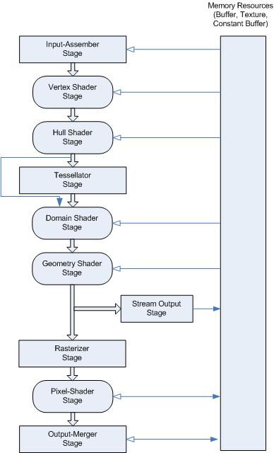

# Introduction

Direct3D 11 Graphics 는 게임, 과학, 어플리케이션 등에 사용하여 3차원 그래픽스를 만들 수 있다.

    Supported runtime environments: Windows/C++
    Recommended programming languages: C/C++
    Minimum supported client: Windows 7
    Minimum supported server: Windows Server 2008 R2

## Topics
* Devices: Direct3D 11 의 devices 와 device-context 에 관한 내용
* Resources: Direct3D 11 의 리소스에 관한 내용
* Graphics pipeline: Direct3D 11 의 파이프 라인에 관한 내용
* Compute shader overview: Compute Shader 에 관한 내용
* Rendering: Direct3D 11 의 몇 가지 렌더링 기술에 관한 내용
* Effects: HLSL 로 작성된 표현식과 효과 프레임워크에 관한 내용
* Migrating to Direct3D 11: 이전 버전의 Direct3D 에서 Direct3D 11 으로 migrating 하는 방법에 관한 내용
* Direct3D video interfaces: Direct3D 비디오 인터페이스에 관한 내용

## 1. Devices

Direct3D device 는 object 를 할당 및 삭제하고 원시 요소를 렌더링하며, 그래픽 드라이버 및 하드웨어와 통신한다.
Direct3D 11 에서 device 는 리소르를 생성하는 device object 와 렌더링을 하기 위한 device-context object 로 구분된다.

하나의 device 에 생성된 object 는 다른 device 와 직접 함께 쓰일 수는 없다.
그러나 shared resource 를 사용하여 여러 device 간에 데이터 공유는 가능하다.
이 경우에는 공유 object 를 생성한 device 에서만 공유 object 를 사용할 수 있다.

### Topics of this section

> * Introduction to a Device in Direct3D 11
> * Software Layers
> * Limitations Creating WARP and Reference Devices
> * Direct3D 11 on Downlevel Hardware
> * Using Direct3D 11 feature data to supplement Direct3D feature levels

## 2. Resources

resource 는 pipeline 에 데이터를 전달하고 장면 중에 렌더링되는 항목을 정의한다.
resource 는 게임에서 로드 될 수 있고, 실시간으로 생성 될 수 있다.
resource 에는 texture data, vertex data, shader data 가 포함된다.
대부분의 Direct3D 가 적용된 어플리케이션에서는 수명이 유지되는 동안 resource 를 생성하고 삭제한다.

### Topics of this section

> * Introduction to a Resource in Direct3D 11
> * Types of Resources
> * Resource Limits
> * Subresources
> * Buffers
> * Textures
> * Floating-point rules
> * Tiled resources

## 3. Graphics Pipeline

Direct3D 11 은 실시간 게임 그래픽을 생성하기 위한 용도로 pipeline 을 설계했다.

Direct3D 11 의 graphics pipeline 은 Direct3dD 10 의 graphics pipeline 과 동일하며, 더 발전된 몇 가지 feature 가 추가 됐다.

pipeline 에 존재하는 모든 stage 에 대한 설정을 Direct3D 11 을 통해 가능하다. 
그림에서 모서리가 둥근 사각형의 경우, HLSL 언어를 통해 프로그래밍 가능하다.
이러한 점은 pipeline 을 유동적이게 만들어 준다.

### Topics of this section

> * Input-Assembler Stage
> * Vertex Shader Stage
> * Tessellation Stages
> * Geometry Shader Stage
> * Stream-Output Stage
> * Rasterizer Stage
> * Pixel Shader Stage
> * Output-Merger Stage

## 4. Compute shader overview

Compute Shader 는 프로그래밍 가능한 shader stage 다. Compute Shader 는 DirectCompute 기술로 잘 알려져 있다.

Vertex Shader 나 Geometry Shader 처럼, Compute Shader 도 HLSL 로 설계되었다. 
그러나 여기까지가 다른 Shader 와 유일한 유사점이다
Compute Shader 는 연산에 있어 빠른 속도를 가지고 있으며, GPU 의 병렬 장치를 이용한다는 점에서 이점을 가진다.
Compute Shader 는 memory sharing 과 thread synchronization 을 제공한다.
이를 통해 효과적인 병렬 프로그래밍이 가능하다.

### Topics of this section

> * New Resource Types
> * Accessing Resources
> * Atomic Functions

## 5. Rendering

Direct3D 11 의 rendering 기술에 관해 서술된다.

### Topics of this section

> * MultiThreading
> * Multiple-Pass Rendering

## 6. Effects

DirectX 의 Effect 는 pipeline 상태의 collection 이다. 그리고 이는 HLSL 로 작성된 식과 Effect 프레임워크에 특화된 구문에 의해 설정된다.

Effect 를 compiling 한 후에, rendering 을 위해 effect framework API 를 사용한다. Effect 는 아래의 범위 등에서 사용되어 질 수 있다.

* vertex shader 를 이용한 geometry 변환
* pixel shader 를 이용한 solid color 출력
* 여러 단계를 거쳐야하는 rendering 기법
* graphics pipeline 의 모든 stage 를 사용
* shader state 및 프로그래밍 가능한 shader 와 연결되지 않은 pipeline state 의 조작 

첫 번째 단계는 effect 에서 제어하려는 state 를 구성하는 것이다. 이는 shader state (vertex, hull, domain, geometry, pixel and compute shaders) 와 texture, shaer 에서 쓰이는 sample state, 그리고 프로그래밍 불가능한 pipeline 의 상태까지 포함한다.
text string 을 이용해 effect 를 memory 에 저장할 수 있다.
그러나 effect 파일에 effect state 를 저장하기 편할 정도로 파일 크기가 커진다. (.fx 로 끝나는 확장자 등)
effect 를 쓰기 위해서는 이것을 반드시 compile 해야 되며, API 호출을 통한 effect state 를 초기화해야 한다. 
또한 render loop 를 수정하여 rendering API 를 호출해야 한다.

effect 는 특정 effect 에 필요한 모든 render state 를 technique 라는 단일 rendering 함수로 캡슐화 한다.
pass 는 render state 를 포함하는 technique 의 하위 집합이다.
다중 pass rendering effect 를 구현하는 것은, 하나 혹은 여러 개의 pass 를 구현하는 것이며 이 pass 는 technique 에 속한다.
예를 들어, depth/stencil buffer 의 한 세트를 이용해 어떤 geometry 를 rendering 하고 싶다고 한다면, 그것의 위에 어떤 sprite 를 그린다.
첫 번째 pass 에서 geometry rendering 을 구현하고, 두 번째 pass 에서는 sprite drawing 을 구현 할 수 있다.
effect 를 rendering 하기 위해, render loop 에서 간단하게 두 개의 pass 모두 render 가능하다.
몇 개의 technique 든지 effect 에서 구현 가능하다. 
물론, technique 의 숫자가 많으면 많을수록, effect 를 compile 하는데 들어가는 시간은 길어진다.
이를 위해 다른 하드웨어에서 effect 가 돌아가도록 만드는 것도 방법이다. 
이를 통해 성능 최적화가 가능하다.

일련의 technique 는 fxgroup 이라는 하나의 그룹으로 묶여진다. 
어떤 식으로든 묶여질 수 있다. 
예를 들어, material 하나마다 여러 개의 그룹을 만들 수 있으며, 각 하드웨어 레벨에 대한 technique 를 가질 수 있다.
또한 각 technique 는 특정 하드웨어에서 material 을 정의하는 일련의 pass 를 가질 수 있다.

### Topics of this section

> * Organizing State in an Effect
> * Effect System Interfaces
> * Specializing Interfaces
> * Interfaces and Classes in Effects
> * Rendering an Effect
> * Cloning an Effect
> * Stream Out Syntax
> * Differences Between Effects 10 and Effects 11

